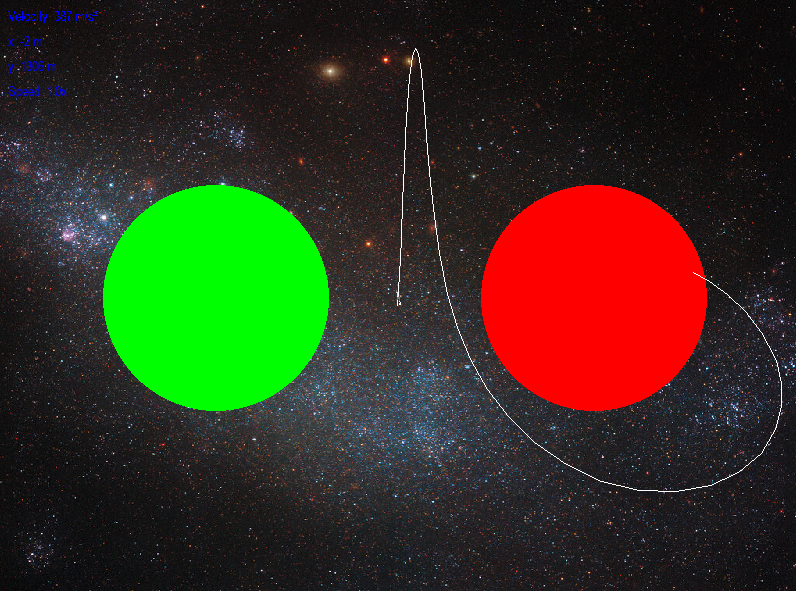
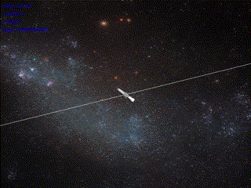

# 🚀 Rocket Simulation

  

## 📖 Opis projektu

Projekt został stworzony z myślą o nauce i rozwoju umiejętności programistycznych.
Głównym celem było stworzenie symulacji lotu rakiety, umożliwiającej przewidywanie trajektorii na dużych dystansach.
Program pozwala na dodawanie nowych planet, zmianę parametrów rakiety i testowanie różnych scenariuszy lotu.

Projekt powstał w ramach studiów na kierunku **Fizyka Techniczna**, a także z chęci zdobycia nowych doświadczeń w programowaniu.

## 🖼 Zrzut ekranu

Widok z symulacji:


Działanie zooma:


## 🚀 Funkcjonalności

- Symulacja lotu rakiety z uwzględnieniem grawitacji planet.
- Możliwość dodawania własnych planet oraz zmiany parametrów rakiety.
- Przewidywanie trajektorii lotu na bardzo dużych dystansach.
- Interaktywna symulacja, gdzie można zmieniać zoom i poruszać się po przestrzeni.

> [!NOTE]  
> Aktualnie planety można tylko dodawać bezpośrednio w kodzie, w pliku `core/game.py`

## 🛠 Instalacja

### Wymagania

Aby uruchomić projekt, musisz mieć zainstalowane następujące biblioteki:

- `numpy==2.2.1`
- `pygame==2.6.1`
- `pymunk==6.9.0`
- `scipy==1.15.1`

Zainstaluj wymagane pakiety, używając polecenia:

```bash
pip install -r requirements.txt
```
Uruchomienie
Sklonuj repozytorium:

```bash
git clone https://github.com/Szynszek/rocket-simulation.git
```
Przejdź do katalogu projektu:

```bash
cd rocket-simulation/rocket-simulation
```
Uruchom program:

```bash
python main.py
```
Zostanie otwarte okno symulacji, w którym można:

- Poruszać się za pomocą strzałek.
- Zmieniać powiększenie za pomocą kółka myszy.

Co zobaczysz na początku:
- Trzy planety: Ziemia oraz dwie fikcyjne planety w pobliżu pozycji startowej rakiety, które pozwalają na testowanie przewidywania trajektorii.

## 🎮 Interakcja

- **Strzałki** – poruszanie rakietą (**Strzałka w góre** – zmiana ciągu).
- **Kółko myszy** lub **Klawisze `-`, `=`** – Zmiana poziomu zoomu.
- **Klawisz `r`** – Restartowanie symulacji.
- **Klawisze `,`, `.`** – Zmiana prędkości symulacji. 

## 🔬 Jak działa symulacja?

Trajektoria lotu rakiety obliczana jest przy użyciu prawa powszechnego ciążenia Newtona:

$$ F = G \cdot \frac{m_1 \cdot m_2}{r^2} $$

Gdzie:
- \( F \) – siła grawitacji,
- \( G \) – stała grawitacyjna,
- \( m₁, m₂ \) – masy ciał (rakieta i planeta),
- \( r \) – odległość między ciałami.

Do obliczeń numerycznych trajektorii rakiety wykorzystano zaawansowany algorytm RK45 (Runge-Kutta 4/5) - popularny algorytm adaptacyjny do rozwiązywania równań różniczkowych, co zapewnia:
- Wysoką dokładność przewidywania trajektorii.
- Efektywne wykorzystanie zasobów obliczeniowych.

## 🛠 Główne biblioteki używane w projekcie

- [**Pygame**](https://www.pygame.org/docs/) – do renderowania wizualizacji symulacji.
- [**Pymunk**](https://www.pymunk.org/en/latest/pymunk.html) – do obsługi fizyki kolizji i symulacji.
- [**SciPy**](https://docs.scipy.org/doc/) – do zaawansowanych obliczeń numerycznych.

## 🌍 Plany na przyszłość

- [ ] Możliwość dodania obiektów bezpośrednio w symulacji, a nie w kodzie.
- [ ] Dodanie dodatkowych sił np. oporu powietrza.
- [ ] Dodanie większej liczby planet (Cały układ słoneczny).
- [ ] Rozbudowa interfejsu użytkownika (UI).
- [ ] Ulepszona zmiana parametrów rakiety.
- [ ] Wprowadzenie nowych funkcji, takich jak możliwość dodawania satelitów czy lepsze przewidywanie trajektorii.
- [ ] Dodanie wieloprocesorowości dla zwiększenia wydajności.
## ‍💻 Autor

Projekt stworzony przez **Szymona Błasiaka**, studenta **Inżynierii Lotniczej i Kosmicznej** oraz **Fizyki Technicznej**. 
[GitHub: Szynszek](https://github.com/Szynszek)
